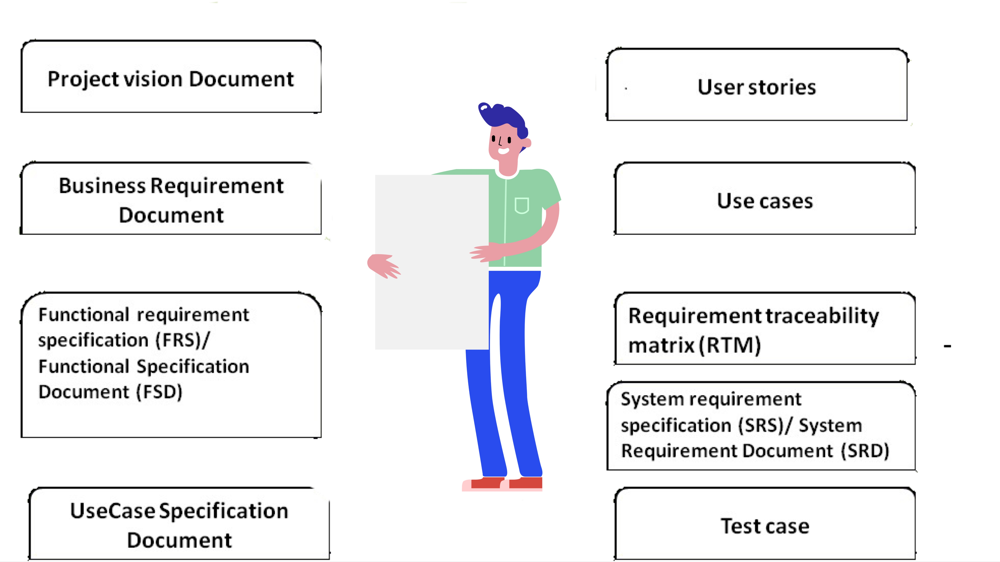
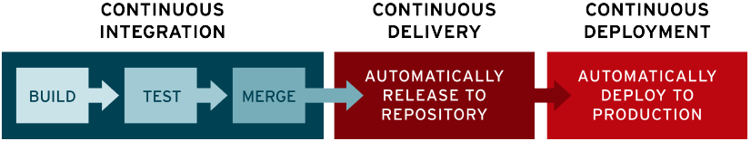
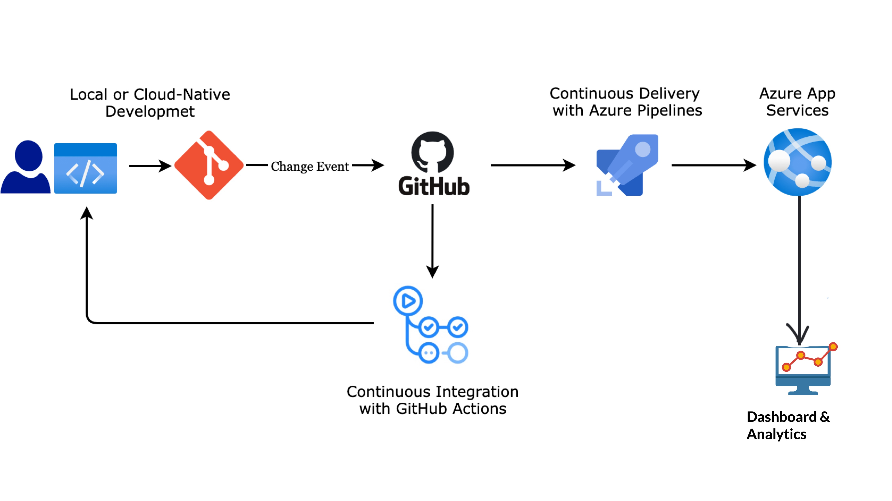
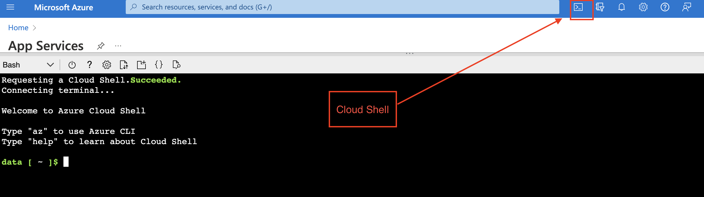
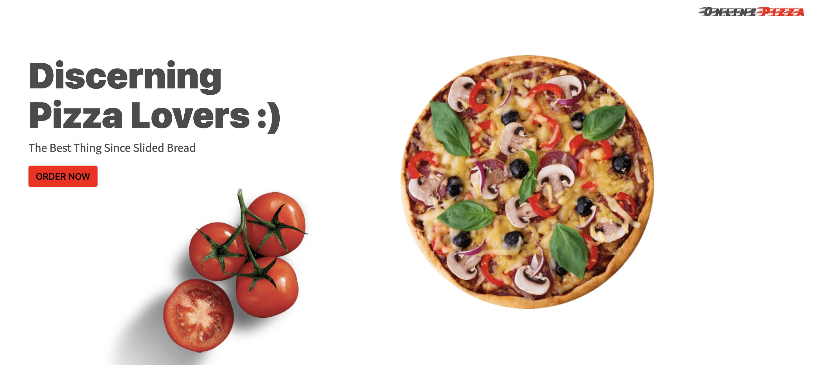

# TJX Dev Fundamentals


## Learning Objectives

#### Conceptual
- Explain what SDLC is and why we use it
- Provide a general overview of what "Agile" means and compare it to Waterfall
- Explain what SCRUM is, and how it relates to agile.
- Describe the process of requirements gathering.
- Explain what a user story is, and what specific points it should include.
- Describe what the backlog is, and how it gets prioritized.
- Describe what a sprint is, and the major parts of a sprint cycle.
- Describe what a wireframe is, and what it accomplishes.
- Describe the structure of a daily scrum meeting.
- Explain what Pivotal Tracker is and what problem it solves

#### Mechanical
- Distill project requirements into user stories.
- Prioritize a backlog, and plan a sprint.
- Wireframe intended application flow before starting work.

## SDLC
- Describes a process for planning, creating, testing, and deploying software
- Process is really important because without one, it's very easy to fall into the following traps:
    + Poor collaboration/communication among team members
    + Poor (or no) estimation of time to complete project
    + Missing or poorly planned features or functionality
    + Poor or no proritization of features
    + Inability to add (or remove) members from the project
    + Scope creep
    + <strike>Software that doesn't actually meet the needs of users</strike>
- Generally the process involves the following steps:
    + Requirements gathering
    + Design
    + Development
    + Testing
    + Bug fixing
    + Deployment

## Agile vs. Waterfall Methodologies

#### Waterfall
- Follows a step by step process where each step waits on the previous one
- Design and develop all features of an application in one fell swoop
- **Advantages**:
    + Clearly defines scope of project
    + Keeps clients and company on the same page, this is what the end result looks like
    + Documentation is potentially easier, allowing newer entrants to get up to speed quickly
- **Disadvantages**:
    + Slow
    + Doesn't adapt well to change
    + Doesn't handle user feedback well
    + Can drown in paperwork and bureaucracy

#### Agile
- Built to adapt to change
- Getting to MVP is the goal
- Relies on tight feedback loops
- <strike>Experimentation is good, as long as we measure the results</strike>
- <strike>Highly analytical</strike>
- **Advantages**:
    + Rapid iteration
    + Built to adapt to change
    + Allows us to catch bugs during the development cycle and not just at the end
    + Provides channels for user feedback to be integrated into future iterations
- **Disadvantages**:
    + Deliverables are constantly changing
    + Bugs can be more common as rapid iteration yields unexpected results
    + Documentation is frequently poor because requirements are changing all the time

## Agile Subsets

#### Kanban

- Kanban is about improving workflow, finding bottlenecks, inefficiencies, other problems
- Implemented by Toyota in the 1940's
- Kanban recommends moving the pieces of work through a "board" of different stages, notably
- Allows us to: 
 * Visualize the work flow - Making the work visible—along with blockers, bottlenecks and queues—instantly leads to increased communication and collaboration
 * Limit the WIP (Work in progress) - You can avoid problems caused by task switching and reduce the need to constantly reprioritize items
 * Focus on the flow - leads to culture of continuous improvements, any potential problems can be seen before it's too late

> Using our development pipeline as an example: if the testers are only able to test 5 features per week whereas the developers and analysts have the capacity to produce 10 features per week, the throughput of the pipeline as a whole will only be 5 features per week because the testers are acting as a bottleneck.

> If the analysts and developers aren't aware that the testers are the bottleneck, then a backlog of work will begin to pile up in front of the testers.

> The effect is that lead times go up. And, like warehouse stock, work sitting in the pipeline ties up investment, creates distance from the market, and drops in value as time goes by.

> Inevitably, quality suffers. To keep up, the testers start to cut corners. The resulting bugs released into production cause problems for the users and waste future pipeline capacity.

> If, on the other hand, we knew where the bottleneck was, we could redeploy resources to help relieve it. For example, the analysts could help with testing and the developers could work on test automation.


#### Scrum
- Scrum is a subset of Agile, it's an "iterative" and "incremental" software development methodology for managing product development
- Scrum recommends breaking things into small pieces of work, and timeboxing our development cycles
- Scrum sets roles like: 
  * Product Owner (defines product vision, priorities, accepts & rejects work performed)
  * Team (implements product)
  * Scrum Master (improves process, sets sprint duration and removes impediments)
- Scrum process: 
  1. Create a product backlog (wishlist)
  2. Sprint planning, what will be in the current sprint? 
  3. Sprint/development (typically 2-4 weeks)
     - Meet daily for scrum meetings, organized by the scrum master
  4. Sprint review - Review the work done with the product owner 
  5. Sprint retrospective - what worked, what didn't about the process
  6. Ship and repeat 
- What is a scrum meeting/standup?
  + When does it happen?
    - Every morning for 15 min
  + What is the structure?
    1. What did I accomplish yesterday? 
    2. What will I work on today? 
    3. What impedes me or is blocking my progress? 
  + What is the point?
    - Longer term plans
  + Release plan
    - Typically requires multiple sprints
  + Product roadmap

#### User Stories

- A user story is a very high-level definition of a requirement, containing just enough information so that the developers can produce a reasonable estimate of the effort to implement it.

- Keep user stories slim and high level
- Anyone is able to write it
- Examples: 
  * Customers can purchase pizza  online using gift cards.
  * Pizza orders can be placed via credit cards.
  * Pizza orders can be placed via PayPal.
  * Storeoweners can input customer details.
  * Customers can obtain their payment information from their existing profile.
  * Customers can order pizzas using points earned.
  * Customers can only create profiles if they haven't have an account with the online store.
- Assign gift points based on how they order , order pattern, frequency of orders, festive sesaons etc.
- Epic stories should be broken down into smaller ones 


## Business Analysts Documentation Steps:
[SDLC Documentaion Format](https://docs.google.com/document/d/1benxfD5JKd-CkTEIQXl7Brwz3a1g0USw/edit?usp=sharing&ouid=103332714627033894482&rtpof=true&sd=true)

    ### Documents Prepared by Business Analyst



## Class Exercise 

**Pair Exercise - 20 min**

## Case Study:

[Agile Case Study](https://www.notion.so/Agile-Case-Study-946fcc5a8d794eefb40f0e37e82dcbda)

Using the cases study given, create simple process flow diagram. You can use slide or word or any tool ( ex. lucid chart(https://lucid.app/)) for creating the diagram.

#### Sprints
- Sprints are development cycles for Scrum
- Use point systems to load with the amount of stories for each sprint
- Scrum requires a working product increment during each sprint. The product itself doesn't have to be shippable, but the increment to the product should be solid and functional

#### Retros
- How can we make our process better next time? How can we continually improve?

## Class Exercise 

**30 min**

Using JIRA [Atlassian](https://www.atlassian.com), add the user stories as a story board based on the case-study given in the earlier exercise.

Here are some example  [JIRA Boards](https://confluence.external-share.com/content/6b39350c-19dc-48bf-a510-1d4e39489e98).


### Steps for cloning git repository in VS code terminals :

1. Go to lab environment

2. Look for the Visual Studio Code icon.

3. Double click on it and launch it

4. In the vscode window , you will see 4 options. Selection Open Folder options.

5. It will open it on a new window. Create a folder here by clicking on the folder icon at top right corner.

6. Once you select open at the bottom of the folder creation window you will land back to vscode window.

7. On vscode folder pane section, right click on the blank are.

8. It will show you 4 options

9. Select the 4th option, Open in integrated terminal.

10. Once you open it in terminal , you will see the terminal window on the right side bottom of the vscode.

11. On the terminal type the command : git clone https://github.com/dataarjun/OnlinePizzaa.git

12. Now you will see all the code folders on left window which was empty earlier.

13. You will see there are 10-12 files and folders. Click on index.html and go through it.

14. Right click on the same and click on open with live server.

16. It will show the Onlinepizza webapp on the browser.


## DFD

### Excercise:

Create a simple high level data  flow diagram that depicts the frontend and backend processes for the Online Pizza Delivery shop.

### You can refer the below example to get started

Example DFD in !https://lucid.app/lucidchart/2e930eb5-c1eb-4a1d-99f8-68b1110db6f7/edit?page=0_0&invitationId=inv_bd809b29-0f4b-46bc-8a0b-9c6651818197# Chart

### OR

!https://online.visual-paradigm.com/


# CI/CD Process and Devops Process Floww

>   CI and CD stand for continuous integration and continuous delivery/continuous deployment. In very simple terms, CI  is a modern software development practice in which incremental code changes are made frequently and reliably. Automated build-and-test steps triggered by CI ensure that code changes being merged into the repository are reliable. The code is then delivered quickly and seamlessly as a part of the CD process. In the software world, the CI/CD pipeline refers to the automation that enables incremental code changes from developers’ desktops to be delivered quickly and reliably to production




## Deploying the calculator app in cloud:

### Clone an existing Git repo
    1. Get the clone URL for an Azure Repos Git repo
    2. Get the clone URL for a GitHub repo
    3. Clone an Azure Repos Git repo
    4. Clone a GitHub repo
    5.  Clone any Git repo
    6. Open a Visual Studio solution from a cloned repo

# CI/CD Pipeline for Machine Learning Project in Azure
Deploying a Flask Machine Learning Application on Azure App Services.

### Status

[](https://github.com/marcoBrighterAI/flask-ml-azure-serverless/actions/workflows/main.yml)

[](https://dev.azure.com/marcopaspuel/Flask-ML-Deploy/_build/latest?definitionId=1&branchName=main)

### Introduction
This project builds a **Continuous Integration** pipeline using **GitHub Actions**, and a **Continuous Delivery** pipeline
using **Azure Pipelines** for a Machine Learning Application. The app is implemented in python using scikit-learn and the
flask module. **Azure App Services** is used to host the application. In this repo you will find all the code and configurations
necessary to implement CI/CD. The ML application is simple, however, it can be easily extended.



### Dependencies
- [Azure Account](https://portal.azure.com) 
- [Azure command line interface](https://docs.microsoft.com/en-us/cli/azure/install-azure-cli?view=azure-cli-latest) (Only if running locally)
- [Azure DevOps Account](https://dev.azure.com/) 

### Project Plan
To follow DevOps best practices, in the links bellow you will find a Kanban Trello board, and a spreadsheet
showing the project plan, project deliverables and project goals.

* [JIRA board](https://jira.external-share.com/issue/426be47e-c3a5-4795-a817-449e66dc0081)

* [Project plan spreadsheet](https://docs.google.com/spreadsheets/d/1858v3Eu1RnLsD6ZOudSua-nVhAD_BDFtSiWJT2F3AwQ/edit?usp=sharing)

### Getting Started

1. Fork this repository
2. Log into the [Azure Portal](https://portal.azure.com) 
3. Launch Azure Cloud Shell 

### Instructions
To run this project in the Azure Cloud Shell, follow the steps bellow. The same steps apply when running locally, however,
you would need to log into your Azure Account from the terminal first.

- [1. Clone the forked repo in Azure Cloud Shell](#1-clone-the-forked-repo-in-azure-cloud-shell)
- [2. Create virtual environment and source](#2-create-virtual-environment-and-source)
- [3. Deploy your app in Azure Cloud](#3-deploy-your-app-in-azure-cloud)
- [4. Verify OninePizza API works](#4-verify-machine-learning-predictions-works)
- [5. Verify Continuous Integration by changing app.py](#5-verify-continuous-integration-by-changing-apppy)
- [6. Create a Webapp in Azure App Services](#6-create-a-webapp-in-azure-app-services)
- [7. Create an Azure DevOps Project and connect to Azure](#7-create-an-azure-devops-project-and-connect-to-azure)
- [8. Create a Pipeline with GitHub Integration](#8-create-a-pipeline-with-github-integration)
- [9. Verify Continuous Delivery by changing app.py](#9-verify-continuous-delivery-by-changing-apppy)
- [10. Verify OnlinePizza Delivery APP in Azure Apps](#10-verify-OnlinePizza-Delivery-App-in-azure-apps)
- [11. Load test the application using Locust](#11-load-test-the-application-using-locust)


#### 1. Clone the forked repo in Azure Cloud Shell ( login to https://portal.azure.com/ and click azure shell)

``` bash 
    git clone https://github.com/dataarjun/OnlinePizzaa.git
    cd OnlinePizzaa/
    ls
```



** Note:  You may need to follow this YouTube video guide on how to [setup SSH keys and configure Azure Cloud Shell with Github](https://www.youtube.com/watch?v=3vtBAfPjQus).

#### 2. Create virtual environment and source
``` bash 
    python -m venv pizzaapp
    source ~/.pizzaapp/bin/activate
```
#### 3. Deploy your app in Azure Cloud . 
To start the app run the following commands:
``` bash 
    
    az webapp up --location westeurope --name OnlinePizzaa --html
```


After running both commands you should see an output like the screenshot bellow.

```
{
  "app_url": "https://&lt;app_name&gt;.azurewebsites.net",
  "location": "westeurope",
  "name": "&lt;app_name&gt;",
  "os": "Windows",
  "resourcegroup": "appsvc_rg_Windows_westeurope",
  "serverfarm": "appsvc_asp_Windows_westeurope",
  "sku": "FREE",
  "src_path": "/home/&lt;username&gt;/quickstart/html-docs-hello-world ",
  &lt; JSON data removed for brevity. &gt;
}
```

## Browse to the app
In a browser, go to the app URL: http://<app_name>.azurewebsites.net.

The page is running as an Azure App Service web app.


#### 4. Verify Continuous Integration by changing index.html
To verify that the Continuous Integration is working you can open the editor in Azure Cloud Shell and change the welcome
message in the [index.htm](https://github.com/dataarjun/OnlinePizzaa/blob/main/index.html) script (line 7). Then commit and push your changes. 
Change the title to "OnlinePizzaa" instead of "OnlinePizza"


Now you can you open your GitHub repo and go to the *Actions* section. You will see that a new pipeline has been triggered.
The pipeline will test your changes and make sure that the code is in a deployable state. See image bellow.


#### Once it's launched you should be able to see the app Home Page in the browser.



#### Once the deployment is triggered the gitHub actions would look as below:


## Thank you

